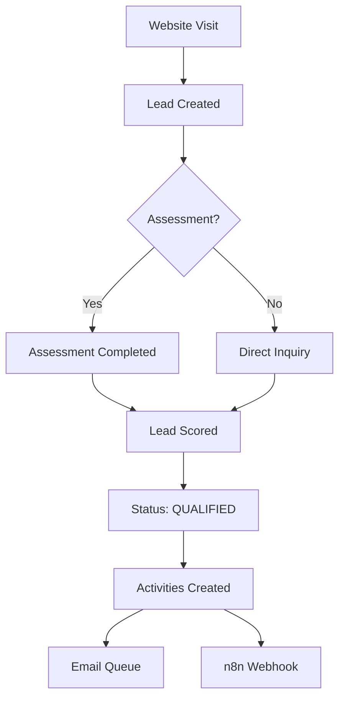
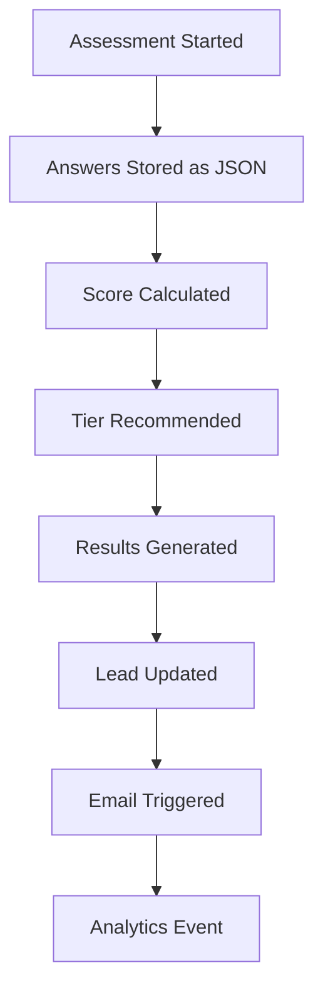

# Database Schema Documentation

## Overview

The MADFAM database schema is designed to support a comprehensive AI consultancy and lead generation system. Built with Prisma ORM and SQLite for development (PostgreSQL for production), the schema supports multi-tier service offerings, AI assessments, ROI calculations, and automated workflows.

## Database Configuration

**Current Setup:**

- **Development**: SQLite (`file:./dev.db`)
- **Production**: PostgreSQL (planned)
- **ORM**: Prisma with TypeScript support
- **Migrations**: Prisma migrate

**Key Features:**

- Strong typing with TypeScript enums
- JSON fields for flexible data storage
- Comprehensive indexing strategy
- Foreign key relationships with cascade deletes
- Audit trail with timestamps

---

## Core Entities

### 🎯 Lead Management

#### **Lead Model**

Primary entity for prospect and customer management.

```prisma
model Lead {
  id          String      @id @default(cuid())
  email       String
  firstName   String?
  lastName    String?
  company     String?
  phone       String?
  tier        ServiceTier
  message     String?
  source      LeadSource  @default(WEBSITE)
  score       Int         @default(0)
  status      LeadStatus  @default(NEW)

  // Business Metadata
  industry    String?
  companySize String?
  budget      String?
  timeframe   String?

  // Marketing Attribution
  utmSource   String?
  utmMedium   String?
  utmCampaign String?
  ipAddress   String?
  userAgent   String?

  // Relations
  assessments Assessment[]
  calculations Calculation[]
  notes       LeadNote[]
  activities  LeadActivity[]

  createdAt   DateTime    @default(now())
  updatedAt   DateTime    @updatedAt

  // Indexes for performance
  @@index([email])
  @@index([status])
  @@index([tier])
  @@index([createdAt])
}
```

**Key Fields:**

- `score` (0-100): Automated lead scoring based on qualification criteria
- `tier`: Service tier interest (L1_ESSENTIALS to L5_STRATEGIC)
- `source`: Attribution tracking for marketing campaigns
- `companySize`: Enum values for business classification

#### **LeadNote Model**

Internal notes and comments on leads.

```prisma
model LeadNote {
  id        String   @id @default(cuid())
  content   String
  leadId    String
  lead      Lead     @relation(fields: [leadId], references: [id], onDelete: Cascade)
  authorId  String?
  author    User?    @relation(fields: [authorId], references: [id])
  createdAt DateTime @default(now())

  @@index([leadId])
}
```

#### **LeadActivity Model**

Activity tracking for lead interactions and automation.

```prisma
model LeadActivity {
  id          String   @id @default(cuid())
  type        String   // email_sent, call_made, meeting_scheduled, etc.
  description String
  leadId      String
  lead        Lead     @relation(fields: [leadId], references: [id], onDelete: Cascade)
  userId      String?
  user        User?    @relation(fields: [userId], references: [id])
  metadata    Json?    // Flexible data for different activity types
  createdAt   DateTime @default(now())

  @@index([leadId])
  @@index([type])
  @@index([createdAt])
  @@index([userId])
}
```

**Common Activity Types:**

- `email_sent` - Email communication
- `call_made` - Phone contact
- `meeting_scheduled` - Appointment booking
- `assessment_completed` - AI readiness assessment
- `calculation_performed` - ROI/project estimate
- `status_updated` - Lead qualification changes
- `note_added` - Internal documentation

---

### 🧠 Assessment System

#### **Assessment Model**

AI readiness assessments with scoring and recommendations.

```prisma
model Assessment {
  id         String           @id @default(cuid())
  leadId     String?
  lead       Lead?            @relation(fields: [leadId], references: [id])
  email      String?
  status     AssessmentStatus @default(STARTED)

  // Assessment Data
  answers    Json             // Question responses (1-5 scale)
  score      Int?             // Calculated score (0-100)
  tier       ServiceTier?     // Recommended service tier

  // AI-Generated Results (stored as JSON arrays)
  strengths  Json?            // ["Strong tech adoption", "Good team"]
  weaknesses Json?            // ["Process gaps", "Resource constraints"]
  recommendations Json?       // ["Start with L3", "Focus on automation"]

  createdAt  DateTime         @default(now())
  completedAt DateTime?

  @@index([email])
  @@index([status])
  @@index([createdAt])
  @@index([leadId])
}
```

**Assessment Algorithm:**

- 10 questions across 4 categories (Technology, Process, Team, Strategy)
- Weighted scoring system (Technology: 30%, Process: 25%, Team: 25%, Strategy: 20%)
- Tier recommendations based on score ranges:
  - 0-30: L1_ESSENTIALS
  - 31-50: L2_ADVANCED
  - 51-70: L3_CONSULTING
  - 71-85: L4_PLATFORMS
  - 86-100: L5_STRATEGIC

---

### 🧮 Calculation System

#### **Calculation Model**

ROI calculations and project estimates for service pricing.

```prisma
model Calculation {
  id           String      @id @default(cuid())
  type         String      // 'roi', 'project_estimate'
  leadId       String?
  lead         Lead?       @relation(fields: [leadId], references: [id])
  email        String?

  // Flexible Input/Output Storage
  inputs       Json        // Request parameters
  results      Json        // Calculated results

  // Summary Fields (for easy querying)
  totalValue   Float?      // Project value or annual savings
  roi          Float?      // Return on investment percentage
  paybackMonths Int?       // Payback period in months

  createdAt    DateTime    @default(now())

  @@index([type])
  @@index([email])
  @@index([createdAt])
  @@index([leadId])
}
```

**Calculation Types:**

1. **ROI Calculator** (`type: 'roi'`)
   - Input: Employee count, salaries, inefficiency percentages
   - Output: Annual savings, ROI percentage, payback period
2. **Project Estimate** (`type: 'project_estimate'`)
   - Input: Project type, complexity, timeline, services
   - Output: Cost breakdown, timeline, deliverables

---

### 👤 User Management

#### **User Model**

Internal team and admin user management.

```prisma
model User {
  id            String         @id @default(cuid())
  email         String         @unique
  name          String?
  role          UserRole       @default(VIEWER)
  image         String?

  // Authentication
  passwordHash  String?
  emailVerified DateTime?

  // Relations
  sessions      Session[]
  leadNotes     LeadNote[]
  leadActivities LeadActivity[]

  createdAt     DateTime       @default(now())
  updatedAt     DateTime       @updatedAt

  @@index([email])
}
```

**User Roles:**

- `ADMIN`: Full system access, user management
- `EDITOR`: Lead management, content creation
- `VIEWER`: Read-only access to leads and reports

#### **Session Model**

Authentication session management (NextAuth.js compatible).

```prisma
model Session {
  id           String   @id @default(cuid())
  sessionToken String   @unique
  userId       String
  expires      DateTime
  user         User     @relation(fields: [userId], references: [id], onDelete: Cascade)

  @@index([userId])
}
```

---

### 🚩 Feature Management

#### **FeatureFlag Model**

Dynamic feature flag system for A/B testing and gradual rollouts.

```prisma
model FeatureFlag {
  id               String   @id @default(cuid())
  key              String   @unique
  name             String
  description      String?
  enabled          Boolean  @default(false)

  // Environment-Specific Controls
  enabledDev       Boolean  @default(true)
  enabledStaging   Boolean  @default(false)
  enabledProd      Boolean  @default(false)

  // Rollout Configuration
  rolloutPercentage Int?    @default(0)
  userGroups       Json?    // ["beta_users", "premium_customers"]

  createdAt        DateTime @default(now())
  updatedAt        DateTime @updatedAt

  @@index([key])
}
```

**Common Feature Flags:**

- `NEW_LEAD_SCORING`: Enhanced scoring algorithm
- `INTERACTIVE_CALCULATOR`: Advanced calculator UI
- `CHAT_SUPPORT`: Live chat integration
- `A11Y_IMPROVEMENTS`: Accessibility enhancements
- `PERFORMANCE_MONITORING`: Advanced analytics

---

### 📊 Analytics & Monitoring

#### **AnalyticsEvent Model**

Custom event tracking for business intelligence.

```prisma
model AnalyticsEvent {
  id         String   @id @default(cuid())
  event      String   // Event name (dot notation: 'lead.created')
  properties Json?    // Event-specific data
  userId     String?  // Internal user (if applicable)
  sessionId  String?  // Session tracking

  // Request Context
  url        String?  // Page URL
  referrer   String?  // Referring page
  userAgent  String?  // Browser information
  ipAddress  String?  // Client IP (anonymized)

  createdAt  DateTime @default(now())

  @@index([event])
  @@index([userId])
  @@index([sessionId])
  @@index([createdAt])
}
```

**Event Categories:**

- `lead.*`: Lead generation events
- `assessment.*`: Assessment completion events
- `calculator.*`: ROI calculation events
- `page.*`: Page view and navigation events
- `conversion.*`: Business conversion events

---

### 📧 Communication System

#### **EmailQueue Model**

Asynchronous email processing and delivery tracking.

```prisma
model EmailQueue {
  id         String   @id @default(cuid())
  to         Json     // ["email1@domain.com", "email2@domain.com"]
  subject    String
  template   String   // Template identifier
  data       Json     // Template variables
  status     String   @default("pending") // pending, sent, failed
  attempts   Int      @default(0)
  error      String?  // Error message if failed

  sentAt     DateTime?
  createdAt  DateTime @default(now())
  updatedAt  DateTime @updatedAt

  @@index([status])
  @@index([createdAt])
}
```

**Email Templates:**

- `welcome`: New lead welcome sequence
- `assessment_results`: AI assessment report
- `roi_report`: ROI calculation summary
- `follow_up`: Automated nurture campaigns
- `meeting_reminder`: Appointment confirmations

---

### 🔗 Integration Management

#### **Integration Model**

Third-party service configurations and status tracking.

```prisma
model Integration {
  id          String   @id @default(cuid())
  name        String   @unique // 'n8n', 'slack', 'crm', 'email'
  enabled     Boolean  @default(true)
  config      Json     // Encrypted configuration data
  webhookUrl  String?  // Webhook endpoint
  apiKey      String?  // Encrypted API key

  lastSync    DateTime? // Last successful sync
  createdAt   DateTime @default(now())
  updatedAt   DateTime @updatedAt

  @@index([name])
}
```

**Integration Types:**

- `n8n`: Workflow automation platform
- `plausible`: Analytics service
- `resend`: Email delivery service
- `slack`: Team notifications
- `crm`: Customer relationship management

---

## Enums Reference

### **ServiceTier**

Business service level classification:

```prisma
enum ServiceTier {
  L1_ESSENTIALS  // 3D design, basic graphics
  L2_ADVANCED    // Parametric design, automation
  L3_CONSULTING  // Workshops, training, process optimization
  L4_PLATFORMS   // SPARK/PENNY implementation
  L5_STRATEGIC   // vCTO partnerships, strategic transformation
}
```

### **LeadStatus**

Lead qualification and processing status:

```prisma
enum LeadStatus {
  NEW          // Initial contact
  CONTACTED    // Outreach attempted
  QUALIFIED    // Meets criteria for services
  UNQUALIFIED  // Does not meet criteria
  CONVERTED    // Became customer
  LOST         // Opportunity closed without conversion
}
```

### **LeadSource**

Marketing attribution and lead origin:

```prisma
enum LeadSource {
  WEBSITE   // Organic website visits
  REFERRAL  // Partner or customer referrals
  SOCIAL    // Social media campaigns
  EVENT     // Conferences, workshops
  DIRECT    // Direct sales outreach
  OTHER     // Miscellaneous sources
}
```

### **UserRole**

Internal access control:

```prisma
enum UserRole {
  ADMIN   // System administration
  EDITOR  // Content and lead management
  VIEWER  // Read-only access
}
```

### **AssessmentStatus**

AI assessment completion tracking:

```prisma
enum AssessmentStatus {
  STARTED     // Assessment in progress
  COMPLETED   // All questions answered
  ABANDONED   // Incomplete, no activity
}
```

---

## Indexing Strategy

### **Performance Indexes**

Optimized for common query patterns:

```sql
-- Lead management queries
CREATE INDEX idx_lead_email ON Lead(email);
CREATE INDEX idx_lead_status ON Lead(status);
CREATE INDEX idx_lead_tier ON Lead(tier);
CREATE INDEX idx_lead_created ON Lead(createdAt);

-- Activity tracking
CREATE INDEX idx_activity_lead ON LeadActivity(leadId);
CREATE INDEX idx_activity_type ON LeadActivity(type);
CREATE INDEX idx_activity_created ON LeadActivity(createdAt);

-- Assessment queries
CREATE INDEX idx_assessment_email ON Assessment(email);
CREATE INDEX idx_assessment_status ON Assessment(status);

-- Analytics queries
CREATE INDEX idx_analytics_event ON AnalyticsEvent(event);
CREATE INDEX idx_analytics_created ON AnalyticsEvent(createdAt);
```

### **Composite Indexes**

For complex queries:

```sql
-- Lead scoring and filtering
CREATE INDEX idx_lead_tier_status ON Lead(tier, status);
CREATE INDEX idx_lead_source_created ON Lead(source, createdAt);

-- Time-series analytics
CREATE INDEX idx_analytics_event_time ON AnalyticsEvent(event, createdAt);
```

---

## Data Flow Patterns

### **Lead Lifecycle**



### **Assessment Flow**



---

## Business Rules

### **Lead Scoring Algorithm**

Base score calculation:

```typescript
let score = 40; // Base score

// Company provided (+15)
if (lead.company) score += 15;

// Phone provided (+10)
if (lead.phone) score += 10;

// Business email domain (+20)
if (isBusinessEmail(lead.email)) score += 20;

// Detailed message (+10)
if (lead.message && lead.message.length > 50) score += 10;

// Tier selection (+5)
if (lead.tier) score += 5;

// Industry relevance (+15 max)
score += calculateIndustryScore(lead.industry);

// Company size (+10 max)
score += calculateSizeScore(lead.companySize);
```

### **Assessment Scoring**

Weighted category scoring:

```typescript
const weights = {
  technology: 0.3,
  process: 0.25,
  team: 0.25,
  strategy: 0.2,
};

const totalScore = Object.entries(answers).reduce((sum, [key, value]) => {
  const category = getQuestionCategory(key);
  return sum + value * weights[category];
}, 0);
```

---

## Migration Strategy

### **Development to Production**

Current SQLite schema can be migrated to PostgreSQL:

1. **Schema Compatibility**: Prisma abstracts database differences
2. **Data Migration**: Export/import via Prisma commands
3. **JSON Fields**: Full PostgreSQL support for complex data
4. **Performance**: Production indexes for scale
5. **Backup Strategy**: Automated PostgreSQL backups

### **Version Control**

```bash
# Create migration
npx prisma migrate dev --name add-feature-flags

# Deploy to production
npx prisma migrate deploy

# Reset development database
npx prisma migrate reset
```

---

## Security Considerations

### **Data Protection**

- **Encryption**: Sensitive fields (API keys, passwords) encrypted at rest
- **Access Control**: Role-based permissions via UserRole enum
- **Audit Trail**: All changes tracked via updatedAt timestamps
- **Data Retention**: Configurable retention policies for GDPR compliance

### **Privacy Compliance**

- **PII Handling**: Lead data classified and protected
- **Anonymization**: IP addresses hashed, user agents truncated
- **Consent Tracking**: Cookie consent and marketing permissions
- **Right to Delete**: Cascade deletes for complete data removal

---

## Monitoring & Maintenance

### **Health Checks**

```sql
-- Lead generation rate
SELECT DATE(createdAt), COUNT(*)
FROM Lead
WHERE createdAt >= DATE('now', '-30 days')
GROUP BY DATE(createdAt);

-- Assessment completion rate
SELECT status, COUNT(*)
FROM Assessment
GROUP BY status;

-- Feature flag usage
SELECT key, enabled, rolloutPercentage
FROM FeatureFlag
WHERE enabled = true;
```

### **Performance Monitoring**

- **Query Performance**: Slow query identification
- **Index Usage**: Analyze query execution plans
- **Data Growth**: Monitor table sizes and growth rates
- **Connection Pooling**: Optimize database connections

---

## Future Enhancements

### **Planned Features**

- **Multi-tenant Architecture**: Support for multiple brands/organizations
- **Advanced Segmentation**: Dynamic lead categorization
- **Predictive Analytics**: ML-based lead scoring improvements
- **Real-time Notifications**: WebSocket-based live updates
- **API Rate Limiting**: Database-backed rate limit tracking

### **Scale Considerations**

- **Sharding Strategy**: Horizontal scaling for large datasets
- **Read Replicas**: Separate read/write database instances
- **Caching Layer**: Redis integration for frequently accessed data
- **Event Sourcing**: Immutable event log for complex business logic

---

Built with ❤️ by MADFAM - Where AI meets human creativity
