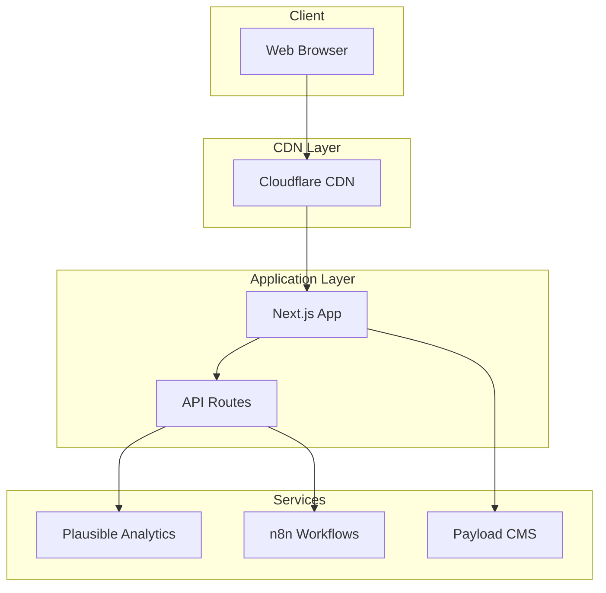
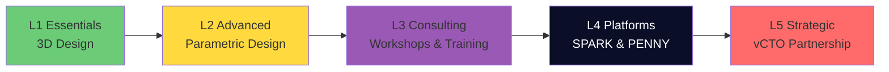
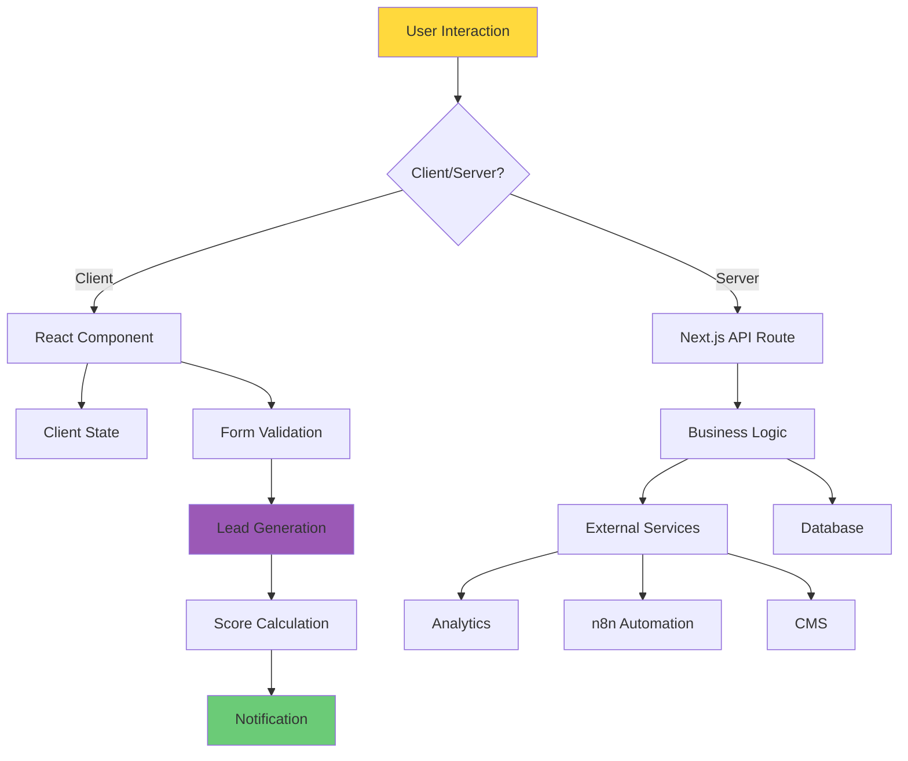

# Architecture Documentation

## Overview

The MADFAM corporate website is built as a modern monorepo using Next.js 14, TypeScript, and Turborepo. This document outlines the architectural decisions, patterns, and structure of the project.

## System Architecture



## Monorepo Structure

### Why Monorepo?

- **Code Sharing**: Share components, types, and utilities across applications
- **Atomic Changes**: Update multiple packages in a single commit
- **Consistent Tooling**: Single set of build tools and configurations
- **Better Refactoring**: Easier to refactor across package boundaries

### Package Organization

```
madfam-corporate/
├── apps/                 # Deployable applications
│   ├── web/             # Main Next.js website
│   └── cms/             # Payload CMS (planned)
├── packages/            # Shared packages
│   ├── ui/              # UI component library
│   ├── core/            # Business logic and types
│   ├── analytics/       # Analytics integration
│   ├── i18n/            # Internationalization
│   └── email/           # Email templates (planned)
└── services/            # Microservices (planned)
    ├── lead-engine/     # Lead scoring service
    └── content-ai/      # AI content generation
```

## Design Patterns

### 1. Hexagonal Architecture

The application follows hexagonal architecture principles:

```
┌─────────────────────────────────────────────────┐
│                   Presentation                   │
│  (Next.js Pages, Components, API Routes)         │
├─────────────────────────────────────────────────┤
│                  Application                     │
│  (Use Cases, Service Orchestration)              │
├─────────────────────────────────────────────────┤
│                    Domain                        │
│  (Business Logic, Entities, Value Objects)       │
├─────────────────────────────────────────────────┤
│                Infrastructure                    │
│  (Database, External APIs, File System)          │
└─────────────────────────────────────────────────┘
```

### 2. Component Architecture

Components follow a hierarchical structure:

- **Atoms**: Basic UI elements (Button, Input, Label)
- **Molecules**: Combinations of atoms (FormField, Card)
- **Organisms**: Complex components (LeadForm, ServiceCard)
- **Templates**: Page layouts
- **Pages**: Actual pages with data

### 3. Service Tier Model

The business logic is organized around a 5-tier service model:



### 4. Data Flow Architecture



```typescript
enum ServiceTier {
  L1_ESSENTIALS = 'essentials',
  L2_ADVANCED = 'advanced',
  L3_CONSULTING = 'consulting',
  L4_PLATFORMS = 'platforms',
  L5_STRATEGIC = 'strategic',
}
```

## Technology Decisions

### Frontend Stack

- **Next.js 14**: App Router for better performance and DX
- **TypeScript**: Type safety and better developer experience
- **Tailwind CSS**: Utility-first CSS with custom design tokens
- **Framer Motion**: Declarative animations

### State Management

- **React Context**: For global state (user preferences, theme)
- **React Hook Form**: Form state management
- **Zod**: Schema validation

### Data Fetching

- **Server Components**: Default for static content
- **Client Components**: Interactive features
- **API Routes**: Backend functionality within Next.js

### Analytics

- **Plausible**: Privacy-first analytics
- **Custom Events**: Lead tracking, conversion funnels
- **No cookies**: GDPR compliant by default

## Performance Optimization

### Build Time

- **Turborepo**: Parallel builds and caching
- **pnpm**: Faster, more efficient package management
- **TypeScript Project References**: Incremental builds

### Runtime

- **ISR**: Incremental Static Regeneration for CMS content
- **Image Optimization**: Next.js Image component
- **Code Splitting**: Dynamic imports for heavy components
- **Font Optimization**: Next.js font optimization

### Caching Strategy

```
┌─────────────┐     ┌─────────────┐     ┌─────────────┐
│   Browser   │────▶│     CDN     │────▶│   Server    │
│   Cache     │     │   Cache     │     │   Cache     │
└─────────────┘     └─────────────┘     └─────────────┘
     1 hour            24 hours           5 minutes
```

## Security Considerations

### Headers

```javascript
{
  'X-Frame-Options': 'DENY',
  'X-Content-Type-Options': 'nosniff',
  'Referrer-Policy': 'strict-origin-when-cross-origin',
  'Content-Security-Policy': "default-src 'self'..."
}
```

### Data Protection

- **Input Validation**: Zod schemas on all forms
- **XSS Prevention**: React's built-in protection
- **CSRF Protection**: Next.js built-in
- **Rate Limiting**: API route protection (planned)

## Deployment Architecture

### Multi-Environment Strategy

```
Development → Staging → Production
   Local      GitHub     Vercel
              Pages
```

### Feature Flags

Feature flags enable:

- Progressive rollouts
- A/B testing
- Quick rollbacks
- Environment-specific features

```typescript
const features = {
  NEW_LEAD_SCORING: {
    development: true,
    staging: true,
    production: false,
  },
};
```

## Scalability Considerations

### Horizontal Scaling

- **Vercel**: Automatic scaling with serverless functions
- **CDN**: Global edge caching
- **Database**: Connection pooling with Prisma

### Vertical Scaling

- **Code Splitting**: Reduce initial bundle size
- **Lazy Loading**: Load components on demand
- **Image Optimization**: Multiple formats and sizes

## Future Architecture Plans

### Phase 1 (Current)

- Static site with API routes
- Basic lead capture
- Manual content updates

### Phase 2 (Q2 2024)

- Payload CMS integration
- Advanced lead scoring
- n8n workflow automation

### Phase 3 (Q3 2024)

- AI-powered content
- Personalization engine
- Advanced analytics

### Phase 4 (Q4 2024)

- Multi-region deployment
- Real-time features
- Mobile app (React Native)

## Decision Log

| Decision     | Rationale                    | Date    |
| ------------ | ---------------------------- | ------- |
| Next.js 14   | Latest features, App Router  | 2024-01 |
| Monorepo     | Code sharing, atomic changes | 2024-01 |
| Tailwind CSS | Utility-first, performance   | 2024-01 |
| Plausible    | Privacy-first analytics      | 2024-01 |
| TypeScript   | Type safety, DX              | 2024-01 |
| Vercel       | Next.js optimization         | 2024-01 |

## References

- [Next.js Documentation](https://nextjs.org/docs)
- [Turborepo Documentation](https://turbo.build/repo/docs)
- [System Design Primer](https://github.com/donnemartin/system-design-primer)
